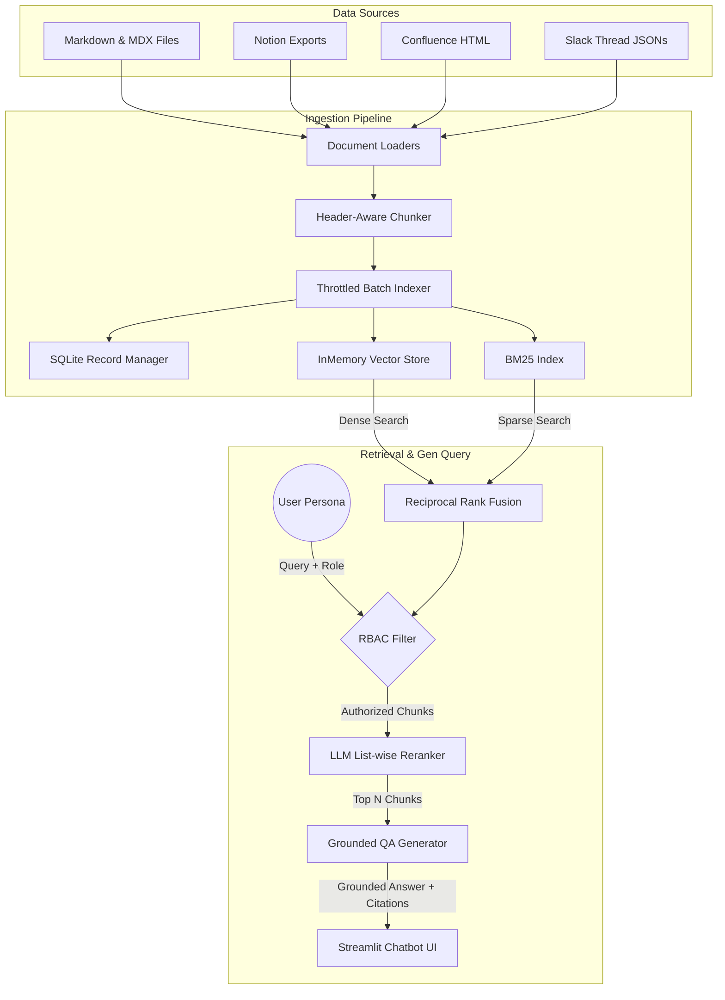

# OnboardIQ: Security-Aware Hybrid Search RAG Copilot

OnboardIQ is an enterprise-grade, role-isolated Retrieval-Augmented Generation (RAG) Copilot designed to assist with corporate onboarding, system architecture lookup, and engineering runbooks. 

The application utilizes **Hybrid Search (Dense Semantic + Sparse Keyword RRF)**, intercepted by strict **Role-Based Access Control (RBAC)** at the retriever level, and ranked by a custom list-wise **LLM Reranker (RankGPT pattern)**. It includes a native scrolling Streamlit chatbot UI and an automated **RAGAS-equivalent LLM-as-a-Judge evaluation harness**.

---

## 🏗️ System Architecture Flowchart



---

## 📂 Codebase Directory Layout

```
OnboardIQ/
├── requirements.txt            # Dependency configuration (LangChain, Streamlit, Pandas, BeautifulSoup)
├── README.md                   # Project documentation
├── .env                        # Local secret configurations (API keys for Gemini, OpenAI, Anthropic)
├── data/                       # Workspace document repositories (Notion, Confluence, Slack, Markdown)
├── db/                         # Serialized storage database assets
│   ├── vector_store.json       # Serialized InMemoryVectorStore state (3072 dimensions)
│   ├── bm25_index.pkl          # Serialized pickle files for BM25 search
│   └── record_manager.db       # SQLite DB storing hashes for incremental indexing
└── onboardiq/
    ├── config.py               # Provider resolution, paths, and LLM wrappers
    ├── generate_dummy_data.py  # Script generating 20+ multinational corporate docs
    ├── slack_loader.py         # Conversational Slack JSON message & thread parser
    ├── confluence_loader.py    # BeautifulSoup-powered HTML table-to-markdown loader
    ├── markdown_loader.py      # Frontmatter loader parsing access roles and metadata
    ├── chunker.py              # Header-aware splitter with context path propagation
    ├── indexer.py              # Throttled incremental indexing coordinator
    ├── vector_store.py         # DB load and dump serializers
    ├── retriever.py            # Hybrid search retrieval & RBAC security filter
    ├── reranker.py             # RankGPT list-wise relevance reordering
    ├── generator.py            # Grounded QA LCEL chains and citations formatter
    ├── evaluator.py            # Automated RAGAS-style metrics judge (Faithfulness, Relevance, Recall)
    ├── pipeline.py             # Master CLI endpoint (Ingest, Query, Evaluate)
    └── app.py                  # Streamlit conversation chatbot application
```

---

## 🚀 Key Architectural Features

### 1. Advanced Document Loaders
* **Conversational Threading (Slack):** [slack_loader.py](file:///Users/monish_ch/Desktop/Agentic%20AI/OnboardIQ/onboardiq/slack_loader.py) groups replies under their parent thread, replaces user IDs with real employee names, and formats chat history into a cohesive discussion.
* **Layout Preserving (Confluence):** [confluence_loader.py](file:///Users/monish_ch/Desktop/Agentic%20AI/OnboardIQ/onboardiq/confluence_loader.py) parses HTML layouts, converting data tables into markdown notation and transforming alert boxes into structured blockquotes.
* **Metadata Extractors (Notion & Markdown):** [markdown_loader.py](file:///Users/monish_ch/Desktop/Agentic%20AI/OnboardIQ/onboardiq/markdown_loader.py) extracts frontmatter YAML fields, parsing tags and security classification levels.

### 2. Header-Path Context Propagation
* The splitter [chunker.py](file:///Users/monish_ch/Desktop/Agentic%20AI/OnboardIQ/onboardiq/chunker.py) breaks long articles into chunks at headings (`#`, `##`, `###`).
* To prevent context loss, the full section hierarchy path (e.g., `Context: Payment Gateway > Endpoints > Create Intent`) is computed and prepended to the body of each leaf chunk.

### 3. Throttled Incremental Indexing
* **SQLite Record Manager:** [indexer.py](file:///Users/monish_ch/Desktop/Agentic%20AI/OnboardIQ/onboardiq/indexer.py) uses a local SQLite database (`db/record_manager.db`) to log document hashes. It skips indexing for unchanged files, updates changed records, and purges deleted documents from the database.
* **Rate-Limit Throttling:** Indexing automatically chunks payloads (50 items per batch) and sleeps for 30 seconds between requests, fully safeguarding against free-tier API rate limits (`429 RESOURCE_EXHAUSTED`).

### 4. Hybrid Search with RBAC Isolation
* **Hybrid Retrieval:** Dense vector search (`gemini-embedding-001`) and sparse keyword matching (`BM25`) are combined using Reciprocal Rank Fusion (RRF).
* **RBAC Filtering:** Document access metadata is verified against the user's active role (`engineering`, `ops`, `admin`). Unauthorized chunks are discarded **prior to reranking**, protecting sensitive data from leaking into the model context.
* **List-Wise Reranker:** Documents are ordered using list-wise RankGPT prompting to bubble the most relevant blocks to the top.

### 5. Automated RAGAS-Equivalent Evaluation
* [evaluator.py](file:///Users/monish_ch/Desktop/Agentic%20AI/OnboardIQ/onboardiq/evaluator.py) runs automated evaluations using an offline LLM-as-a-judge pattern measuring:
  * **Faithfulness:** Verifies all statements in the answer are strictly supported by the context (groundedness).
  * **Answer Relevance:** Scores how directly the answer addresses the user query.
  * **Context Recall:** Rates if the search engine successfully retrieved all facts matching the reference `ground_truth`.

---

## ⚙️ Environment Setup

1. Copy `.env.template` (or create a new `.env` file) in your project root:
   ```env
   # API Keys (Set keys for your active providers)
   GEMINI_API_KEY="your-gemini-key"
   OPENAI_API_KEY="your-openai-key"
   ANTHROPIC_API_KEY="your-anthropic-key"
   ```
2. Verify dependencies are installed:
   ```bash
   pip install -r requirements.txt
   ```

---

## 💻 Running the Application

Always execute commands with `PYTHONPATH=.` set in your terminal from the project root directory.

### 1. Populate the Dummy Datasets
Generate 20+ multinational corporate wiki pages, runbooks, and Slack threads inside `/data`:
```bash
PYTHONPATH=. .venv/bin/python onboardiq/generate_dummy_data.py
```

### 2. Ingest and Index Documents
Run the document ingestion pipeline to compute vector coordinates and compile the BM25 index:
```bash
PYTHONPATH=. .venv/bin/python onboardiq/pipeline.py --ingest
```

### 3. Query the Copilot (CLI)
Query the knowledge base directly from the command line while verifying security permissions:
```bash
PYTHONPATH=. .venv/bin/python onboardiq/pipeline.py --query "What is the NAT Gateway IP address?" --role "ops"
```

### 4. Run Automated Evaluations
Measure Faithfulness, Relevance, and Recall metrics against the gold evaluation test cases:
```bash
PYTHONPATH=. .venv/bin/python onboardiq/pipeline.py --evaluate
```

### 5. Start the Chatbot (Streamlit Web UI)
Launch the Premium Streamlit chatbot application:
```bash
.venv/bin/streamlit run onboardiq/app.py
```
*(Open the URL printed in the terminal, usually `http://localhost:8501`, in your web browser).*
